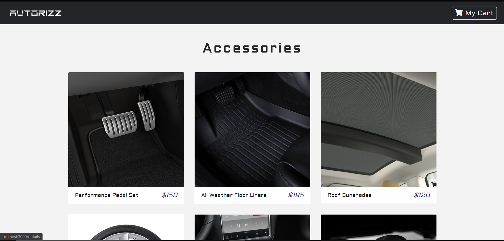
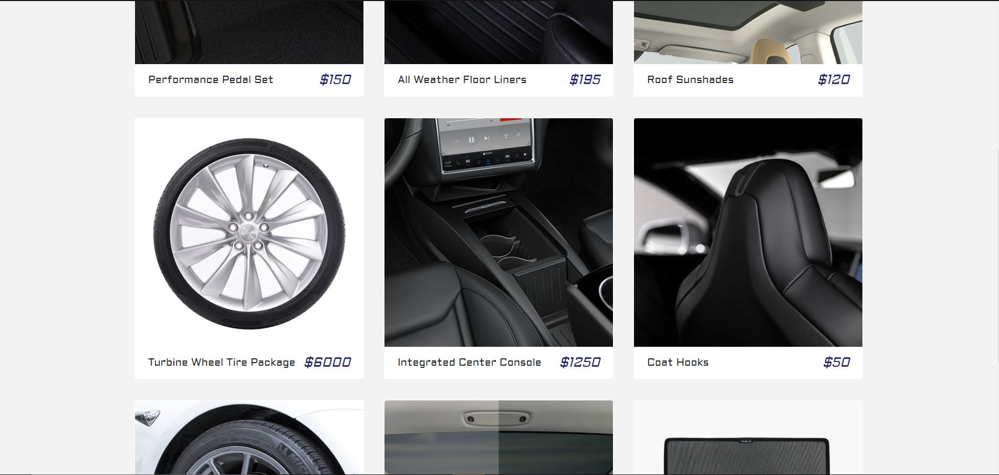
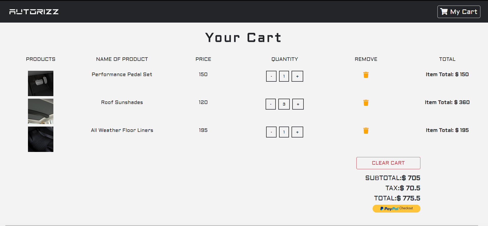

   

# Spare-Part-Inventory-Using-React-JS
## Description
### Accessories-Inventory-Using-React-JS is a Web Application used for managing and buying spare parts 
### Home Page

### Adding To Cart

### Cart

